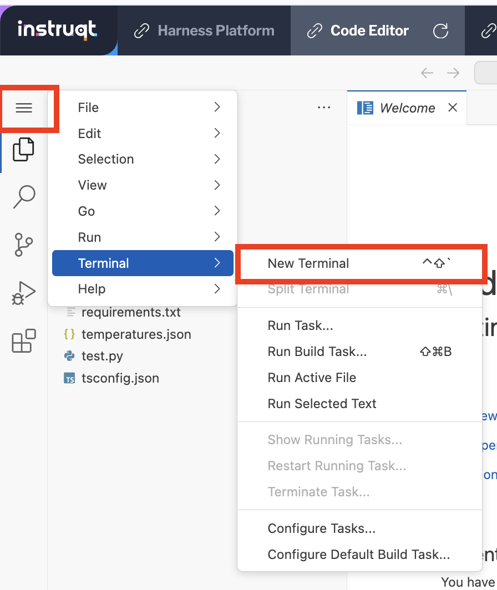

<style type="text/css" rel="stylesheet">
hr.cyan { background-color: cyan; color: cyan; height: 2px; margin-bottom: -10px; }
h2.cyan { color: cyan; }
</style><h2 class="cyan">Feature Releases (the old way)</h2>
<hr class="cyan">
<br>

> # Switch to the ```Code Editor``` tab to continue
From here we can look at the application we will be "releasing."

**Terminal**

To open a terminal, you can either use a keyboard combination like CMD+SHIFT+P or CTRL+SHIFT+P and find the **Terminal: Create New Terminal** option.

Alternatively, you can open a terminal using the File menu in the Code Editor:


## The Application
Familiarize yourself with the application. In this case, it's a simple Python application that models what we might see from a backend microservice. This microservice is a "weather API" that returns the current temperature from a city you provide as a query, first in Celsius then in Fahrenheit measurements.

## Build and Deploy
Run the following command to build your application
```
docker build -t weather-api .
```
Then run the following command to "deploy" it in a testing mode.
```
docker run -p 5000:5000 weather-api
```
Open the "Sample App" tab in Instruqt and see the outputs for various cities.

Verify the output of the test is as-expected, and rerun several more times to verity the behavior and performance.

Once you are confident, stop the container in the "Code Editor" tab (CTRL-C)


## Introduce a Change
Given the current application performance, we believe that we can improve times by introducing caching. We expect that times for the same response will be near-instantaneous as we will save responses and re-use them for future requests.

1. Switch to the `cachingv1` branch
>```
>git checkout cachingv1
>```
2. Re-run the previous steps to build and run your Docker container
>```
>docker build -t weather-api .
>docker run -p 5000:5000 weather-api
>```
3. Open the "Sample App" tab again

The performance on each run is significantly faster, but do you see any issues?

...

...

...

That's right, caching seems to just be producing the same output for both Fahrenheit and Celsius regardless of what city is tested. You've introduced a breaking change into the `weather-api` service!

Feel free to stop the docker container in your terminal with CTRL-C.

===============

Click the **Check** button to continue.
