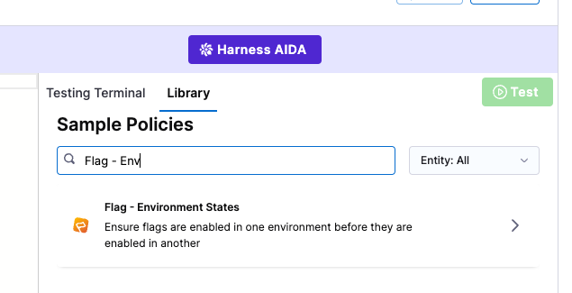
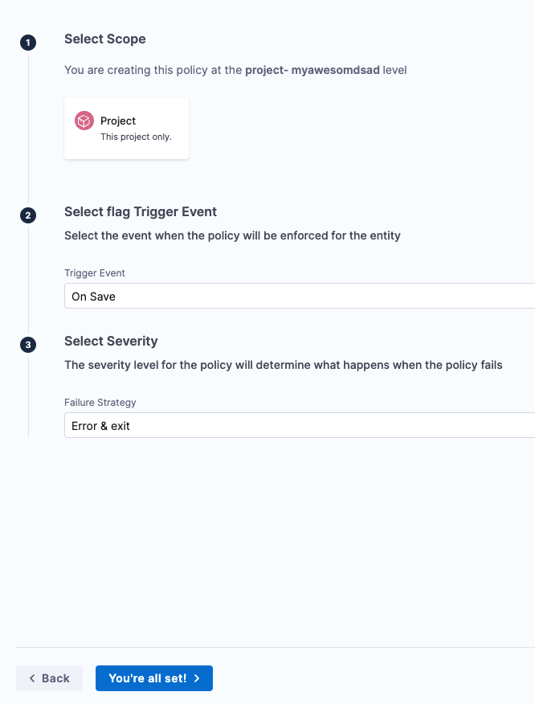
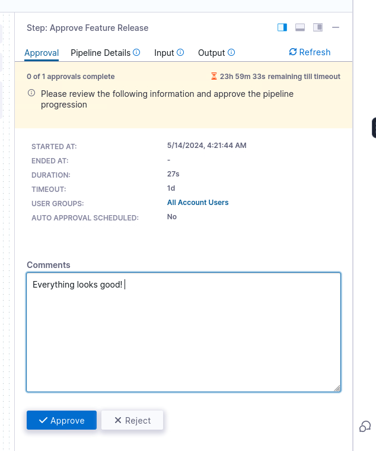

<h2 class="cyan">Governance & Efficiency</h2>

 

> # Governance
Now that we have the ability to create Feature Flags, we may have some rules or best practices we want to enforce. Luckily, [Harness has the ability to use OPA policies anywhere in the platform](https://developer.harness.io/docs/feature-flags/harness-policy-engine/) to help enforce and govern these best practices or even change management/compliance requirements!

1. Expand **Feature Flags** in the secondary navigation panel and select **Environments**
2. Click **+New Environment**
3. Name your environment **stage** and keep the Environment Type as **Non-production**. Click **Create**
4. Click **+New SDK Key** on the pop-up screen
5. Call your SDK key **stage** and click **Create**. Keep this key handy as you cannot get it back once you leave this page.
6. Expand **Project Setup** in the secondary navigation panel and select **Environments**
7. Click **+New Environment** button
8. Name your environment **production** and toggle the Environment Type to **Production**. Click **Create**
9. Click **+New SDK Key** on the SDK Keys pop-up screen
10. Call your SDK key **production** and click **Create**. Again, keep this key handy.
11. Create a Governance Policy
    1.  Hover over **Project Settings** in your left hand pane
    2.  Click on **Policies** under **Security and Governance**
    3.  Click **Build a Sample Policy**
    4.  Scroll down and select **Flag - Environment States**
    
    5. Click **Next: Test Policy >**
    6. Click **Next: Enforce Policy >**
    7. In #2 **Select flag Trigger Event** select **On Save** from the dropdown
    8. In #3 **Select Severity** select **Error & exit** from the dropdown
    9. Click **You're all set!** and **Yes** to apply this policy.
    
 12. Test Policy
     1.  Navigate to the Feature Flags in the secondary navigation panel on the left.
     2.  Note in the upper right that you can toggle between your development and production environments
     
     3.  Verify your flag is in the **off** position in development
     4.  Switch to your production environment
     5.  Turn the flag on. What happens?

> # Pipelines
Often, as your Feature Flags operations grow you may want to enforce a best practice of feature releases going through a regimented process. Maybe you want to release to your beta users first, followed by a slow procedural rollout to GA users, before you ultimately turn all the flags into fully integrated features and remove old stale feature flags.

Harness pipelines allow us to define these series of events and scale them across your Feature Flag strategies within your organization!

1. Click on **Pipelines** in the left hand panel
2. Click **+Create a Pipeline**
   1. Enter **release** in the name field
   2. Click **Start**
   3. Click **+ Add Stage**
   4. Select a Feature Flag Stage
   5. Provide the name **release**
   6. Click **Setup Stage**
3. Add an approval step within the new Feature Flag Stage
   1. Click **+ Add Step &rarr; Add Step** in the lower Pipeline Studio Panel
   2. Select **Harness Approval** in the Approval section of the pop-up Step Library
   3. In the Manual Approval configuration pop-up screen
      1. Change the name to **Approve Feature Release**
      2. Modify User Groups and add **All Account Users**
   4. Click **Apply Changes**
4. Add feature change
   1. After the Approval step, click **+ Add Step &rarr; Add Step**
   2. Select **Flag Configuration**
   3. Change the name to **Enable Cache**
   4. Add environment **development** in the **Select Environment** field
   5. Add flag **cache_result** in the **Select Flag** field
   6. Add **ON** in the **Set Flag Switch** field
   7. Click **Apply Changes**
5. Save your pipeline by selecting **Save** in the upper right corner.
6. Click **Run** and **Run Pipeline** on the dialog popup
7. Watch the pipeline run and Approve the change when that step activates (should be a small button in the lower left of that step's Harness output)

8. Verify your flag has changed by navigating to the feature flags page and selecting "All Environments""

> # Congratulations on completing this FF hands-on workshop!

With only a little more preparation from our documentation, you should be ready to pass our free [Feature Flag Developer Certification](https://developer.harness.io/university/feature-flags).

Head over to Harness University and give it a try!

===============

Click the **Check** button to continue.
